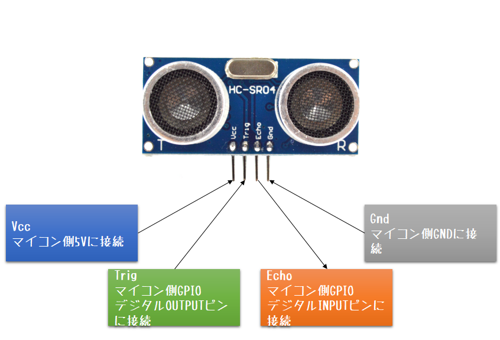
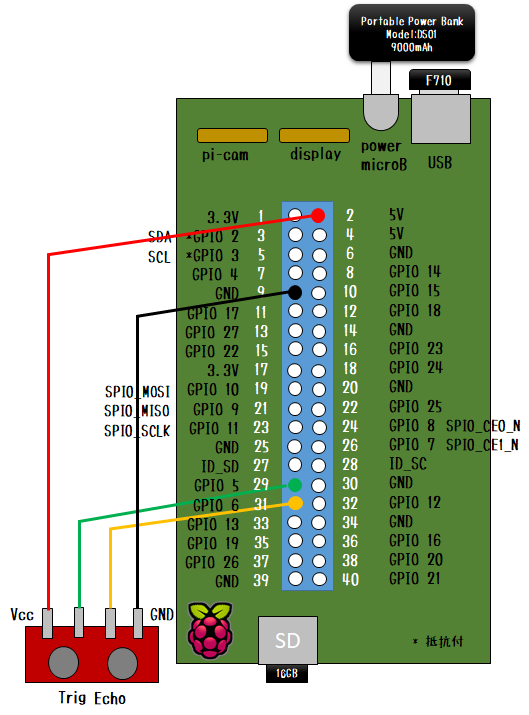

# Donkey Carに超音波距離計測センサを搭載する

## HC-SR04

ここでは、[超音波距離センサモジュール HC-SR04（SparkFun販売品）](https://www.switch-science.com/catalog/2860/) を使用します。

### 製品諸元

| 項目名 | 値 |
|:-----|--:|
| 電源電圧 | 5 V |
| 待機電流 | 2 mA未満 |
| 信号出力 | 0～5 V |
| センサ角度 | 15 度以下 |
| 測定可能距離 | 2～400 cm |
| 分解能 | 0.3 cm |
| 端子間隔 | 2.54 mm |

### ピン仕様

ピン仕様は、以下の図のとおりです。



### 計測方法

1. トリガ端子を10 us以上Highにしてください。
2. このセンサモジュールが40 kHzのパルスを8回送信して受信します。
3. 受信すると、出力端子がHighになります。
4. 出力端子がHighになっている時間がパルスを送信してから受信するまでの時間です。
5. 出力端子がHighになっている時間の半分を音速で割った数値が距離です。

## パーツクラスのインストール

### センサの接続

Raspberry Pi を停止状態にして、以下の図の接続例のようにセンサを結線します。



|センサ側|Raspberry Pi側|備考|
|:------|:-------------|:---|
|Vcc|5V|5Vで稼働する|
|Trig|GPIO5|何も割り当てられていないGPIOピンでよい|
|Echo|GPIO6|何も割り当てられていないGPIOピンでよい|
|Gnd|GND|GNDのいずれか１つのピンでよい|


### pigpioパッケージのインストール

#### pigpiod の常時起動設定

1. `sudo vi /etc/systemd/system/pigpiod.service`
   ```ini
   Description = pigpio daemon
   
   [Service]
   ExecStart = /usr/bin/pigpiod
   Restart = always
   Type = forking
   
   [Install]
   WantedBy = multi-user.target
   ```
2. `sudo systemctl daemon-reload`
3. `sudo systemctl enable pigpiod.service`
4. `sudo reboot`

#### pip パッケージの追加

1. `pip install pigpio`

#### pigpiod の動作状態確認

1. `sudo systemctl status pigpiod`

### 本リポジトリのインストール

1. `git clone https://github.com/coolerking/donkeypart_hc_sr04.git`
2. `cd donkeypart_hc_sr04`
3. `pip install -e .`


### config.pyの編集

1. `cd ~/mycar`
2. 接続したGPIOピン番号をもとに`config.py`を編集する
   ```python
   RANGE_TRIG_GPIO = 5
   RANGE_ECHO_GPIO = 6
   RANGE_GPIOS = [
       RANGE_TRIG_GPIO,
       RANGE_ECHO_GPIO
   ]
   ```

### manage.pyの編集
1. manage.pyの関数driveの適当な位置にパーツ`Sensor`を追加する
   ```python
       :
       import pigpio
       pi = pigpio.pi()
       :

       :
       from donkeypart_sonicrangesensor import Sensor
       range = Sensor(pi, cfg.RANGE_GPIOS)
       V.add(range, outputs=['range/cms'], threaded=True)
       :
   ```

### 補足：Tubデータ追加

Tubデータとして使用する場合は、`manage.py`の`drive()`内のTubWriter記述を変更します。


以下修正例です。

```python
    # Tubデータの定義
    inputs = [
        'cam/image_array', 
        'user/left/value',  'user/left/status', 
        'user/right/value', 'user/right/status', 
        'user/lift/value',  'user/lift/status', 
        'range/cms',
        'user/mode',        'timestamp']
    types = [
        'image_array',
        'float',            'str',
        'float',            'str', 
        'float',            'str',
        'float',
        'str',              'str']

    # multiple tubs
    # th = TubHandler(path=cfg.DATA_PATH)
    # tub = th.new_tub_writer(inputs=inputs, types=types)

    # Tubデータ書き込み
    from donkeycar.parts.datastore import TubWriter
    tub = TubWriter(path=tub_dir, inputs=inputs, types=types)
    V.add(tub, inputs=inputs, run_condition='recording')
```

## ライセンス

本リポジトリのソースコードは [MITライセンス](./LISENSE) 準拠とします。